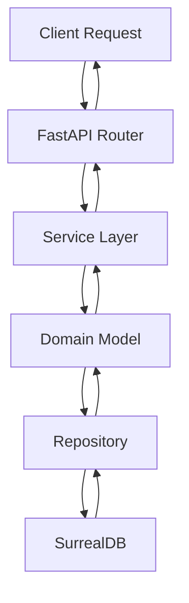
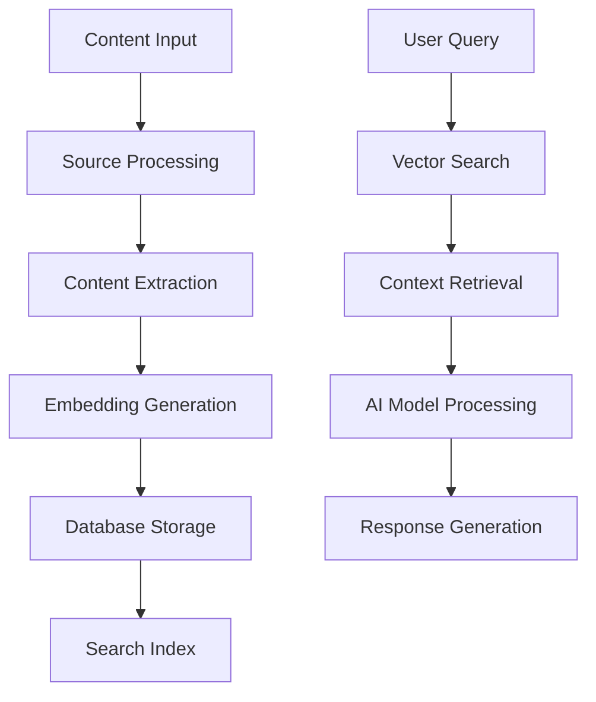
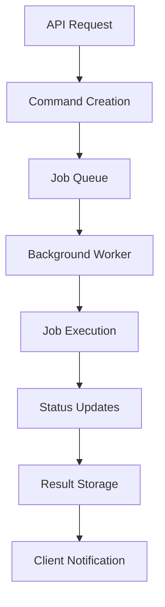
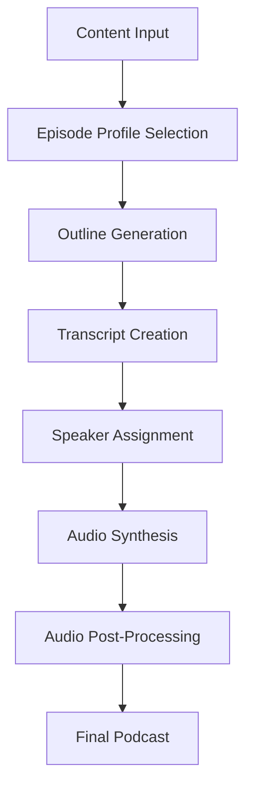

# System Architecture

This document provides a comprehensive overview of Open Notebook's architecture, including system design, component relationships, database schema, and service communication patterns.

## 🏗️ High-Level Architecture

Open Notebook follows a modern layered architecture with clear separation of concerns:

```
┌─────────────────────────────────────────────────────────────┐
│                    Frontend Layer                           │
├─────────────────────────────────────────────────────────────┤
│  React frontend (pages/)  │  REST API Clients (external)     │
└─────────────────────────────────────────────────────────────┘
                                │
                                ▼
┌─────────────────────────────────────────────────────────────┐
│                    API Layer                                │
├─────────────────────────────────────────────────────────────┤
│  FastAPI Routers (api/routers/)  │  Models (api/models.py)  │
│  Middleware (auth, CORS)         │  Service Layer           │
└─────────────────────────────────────────────────────────────┘
                                │
                                ▼
┌─────────────────────────────────────────────────────────────┐
│                   Domain Layer                              │
├─────────────────────────────────────────────────────────────┤
│  Business Logic (open_notebook/domain/)                     │
│  Entity Models │ Validation │ Domain Services              │
└─────────────────────────────────────────────────────────────┘
                                │
                                ▼
┌─────────────────────────────────────────────────────────────┐
│                Infrastructure Layer                         │
├─────────────────────────────────────────────────────────────┤
│  Database (SurrealDB)  │  AI Services (Esperanto)         │
│  File Storage         │  External APIs                    │
└─────────────────────────────────────────────────────────────┘
```

## 🧩 Core Components

### 1. API Layer (`api/`)

**Purpose**: HTTP interface for all application functionality

**Key Components**:
- **FastAPI Application** (`api/main.py`): Main application with middleware and routing
- **Routers** (`api/routers/`): Endpoint definitions organized by domain
- **Models** (`api/models.py`): Pydantic models for request/response validation
- **Services** (`api/*_service.py`): Business logic orchestration
- **Authentication** (`api/auth.py`): Password-based authentication middleware

**Architecture Pattern**: Clean API architecture with service layer abstraction

```python
# Example API structure
@router.post("/notebooks", response_model=NotebookResponse)
async def create_notebook(notebook: NotebookCreate):
    """Create a new notebook with validation and error handling."""
    new_notebook = Notebook(name=notebook.name, description=notebook.description)
    await new_notebook.save()
    return NotebookResponse.from_domain(new_notebook)
```

### 2. Domain Layer (`open_notebook/domain/`)

**Purpose**: Core business logic and domain models

**Key Components**:
- **Base Models** (`base.py`): Abstract base classes with common functionality
- **Entities**: `Notebook`, `Source`, `Note`, `Model`, `Transformation`
- **Services**: Domain-specific business logic
- **Validation**: Data integrity and business rules

**Architecture Pattern**: Domain-Driven Design (DDD) with rich domain models

```python
# Example domain model
class Notebook(BaseModel):
    name: str
    description: str
    archived: bool = False
    
    @classmethod
    async def get_all(cls, order_by: str = "updated desc") -> List["Notebook"]:
        """Retrieve all notebooks with ordering."""
        # Business logic implementation
        
    async def save(self) -> None:
        """Save notebook with validation."""
        # Domain validation and persistence
```

### 3. Database Layer (`open_notebook/database/`)

**Purpose**: Data persistence and query abstraction

**Key Components**:
- **Repository Pattern** (`repository.py`): CRUD operations abstraction
- **Connection Management**: Async SurrealDB connection handling
- **Migrations**: Database schema evolution (`migrations/`)
- **Query Builder**: SurrealQL query construction helpers

**Architecture Pattern**: Repository pattern with async/await

```python
# Repository functions
async def repo_create(table: str, data: Dict[str, Any]) -> Dict[str, Any]
async def repo_query(query_str: str, vars: Optional[Dict[str, Any]] = None) -> List[Dict[str, Any]]
async def repo_update(table: str, id: str, data: Dict[str, Any]) -> List[Dict[str, Any]]
async def repo_delete(record_id: Union[str, RecordID])
```

### 4. AI Processing Layer (`open_notebook/graphs/`)

**Purpose**: AI workflows and content processing

**Key Components**:
- **LangChain Graphs**: Multi-step AI workflows
- **Ask System** (`ask.py`): Question-answering pipeline
- **Chat System** (`chat.py`): Conversational AI
- **Transformations** (`transformation.py`): Content analysis workflows
- **Source Processing** (`source.py`): Content ingestion and embedding

**Architecture Pattern**: LangGraph for workflow orchestration

```python
# Example AI workflow
@create_graph
async def ask_graph(state: AskState):
    """Multi-step question answering workflow."""
    # 1. Strategy generation
    # 2. Search execution
    # 3. Answer synthesis
    # 4. Final response generation
```

### 5. Background Processing (`commands/`)

**Purpose**: Asynchronous job processing

**Key Components**:
- **Command System**: Background job definitions
- **Job Queue**: SurrealDB-backed job scheduling
- **Status Tracking**: Real-time job progress monitoring
- **Error Handling**: Comprehensive error recovery

**Architecture Pattern**: Command pattern with async job queue

## 🗃️ Database Schema

Open Notebook uses SurrealDB with a flexible document-oriented schema:

### Core Tables

#### `notebook`
```surrealql
DEFINE TABLE notebook SCHEMAFULL;
DEFINE FIELD name ON TABLE notebook TYPE string;
DEFINE FIELD description ON TABLE notebook TYPE string;
DEFINE FIELD archived ON TABLE notebook TYPE bool DEFAULT false;
DEFINE FIELD created ON TABLE notebook TYPE datetime DEFAULT time::now();
DEFINE FIELD updated ON TABLE notebook TYPE datetime DEFAULT time::now();
```

#### `source`
```surrealql
DEFINE TABLE source SCHEMAFULL;
DEFINE FIELD title ON TABLE source TYPE option<string>;
DEFINE FIELD topics ON TABLE source TYPE option<array<string>>;
DEFINE FIELD asset ON TABLE source TYPE option<object>;
DEFINE FIELD full_text ON TABLE source TYPE option<string>;
DEFINE FIELD notebook_id ON TABLE source TYPE record<notebook>;
DEFINE FIELD embedding ON TABLE source TYPE option<array<number>>;
DEFINE FIELD created ON TABLE source TYPE datetime DEFAULT time::now();
DEFINE FIELD updated ON TABLE source TYPE datetime DEFAULT time::now();
```

#### `note`
```surrealql
DEFINE TABLE note SCHEMAFULL;
DEFINE FIELD title ON TABLE note TYPE option<string>;
DEFINE FIELD content ON TABLE note TYPE option<string>;
DEFINE FIELD note_type ON TABLE note TYPE option<string>;
DEFINE FIELD notebook_id ON TABLE note TYPE record<notebook>;
DEFINE FIELD embedding ON TABLE note TYPE option<array<number>>;
DEFINE FIELD created ON TABLE note TYPE datetime DEFAULT time::now();
DEFINE FIELD updated ON TABLE note TYPE datetime DEFAULT time::now();
```

#### `model`
```surrealql
DEFINE TABLE model SCHEMAFULL;
DEFINE FIELD name ON TABLE model TYPE string;
DEFINE FIELD provider ON TABLE model TYPE string;
DEFINE FIELD type ON TABLE model TYPE string;
DEFINE FIELD created ON TABLE model TYPE datetime DEFAULT time::now();
DEFINE FIELD updated ON TABLE model TYPE datetime DEFAULT time::now();
```

### Specialized Tables

#### `transformation`
```surrealql
DEFINE TABLE transformation SCHEMAFULL;
DEFINE FIELD name ON TABLE transformation TYPE string;
DEFINE FIELD title ON TABLE transformation TYPE string;
DEFINE FIELD description ON TABLE transformation TYPE string;
DEFINE FIELD prompt ON TABLE transformation TYPE string;
DEFINE FIELD apply_default ON TABLE transformation TYPE bool DEFAULT false;
```

#### `episode_profile` (Podcast Generation)
```surrealql
DEFINE TABLE episode_profile SCHEMAFULL;
DEFINE FIELD name ON TABLE episode_profile TYPE string;
DEFINE FIELD description ON TABLE episode_profile TYPE option<string>;
DEFINE FIELD speaker_config ON TABLE episode_profile TYPE string;
DEFINE FIELD outline_provider ON TABLE episode_profile TYPE string;
DEFINE FIELD outline_model ON TABLE episode_profile TYPE string;
DEFINE FIELD transcript_provider ON TABLE episode_profile TYPE string;
DEFINE FIELD transcript_model ON TABLE episode_profile TYPE string;
DEFINE FIELD default_briefing ON TABLE episode_profile TYPE string;
DEFINE FIELD num_segments ON TABLE episode_profile TYPE int DEFAULT 5;
```

#### `speaker_profile` (Podcast Generation)
```surrealql
DEFINE TABLE speaker_profile SCHEMAFULL;
DEFINE FIELD name ON TABLE speaker_profile TYPE string;
DEFINE FIELD description ON TABLE speaker_profile TYPE option<string>;
DEFINE FIELD tts_provider ON TABLE speaker_profile TYPE string;
DEFINE FIELD tts_model ON TABLE speaker_profile TYPE string;
DEFINE FIELD speakers ON TABLE speaker_profile TYPE array<object>;
DEFINE FIELD speakers.*.name ON TABLE speaker_profile TYPE string;
DEFINE FIELD speakers.*.voice_id ON TABLE speaker_profile TYPE option<string>;
DEFINE FIELD speakers.*.backstory ON TABLE speaker_profile TYPE option<string>;
DEFINE FIELD speakers.*.personality ON TABLE speaker_profile TYPE option<string>;
```

### Relationships

**Record Links** (SurrealDB native relationships):
- `source.notebook_id` → `notebook` records
- `note.notebook_id` → `notebook` records
- `episode.command` → `command` records

**Embedding Relationships**:
- Sources and notes can have vector embeddings for semantic search
- Embeddings are stored as arrays of numbers in the same record

## 🔄 Service Communication

### API Communication Flow



### AI Processing Flow



### Background Job Processing



## 🔧 Configuration Management

### Environment Variables

**Database Configuration**:
```bash
SURREAL_URL=ws://localhost:8000/rpc
SURREAL_USER=root
SURREAL_PASSWORD=password
SURREAL_NAMESPACE=open_notebook
SURREAL_DATABASE=main
```

**AI Provider Configuration**:
```bash
OPENAI_API_KEY=sk-...
ANTHROPIC_API_KEY=sk-ant-...
GOOGLE_API_KEY=AI...
```

**Application Configuration**:
```bash
APP_PASSWORD=optional_password
DEBUG=false
LOG_LEVEL=INFO
```

### Configuration Loading

Configuration is managed through the `open_notebook/config.py` module:

```python
class Config:
    """Application configuration with environment variable support."""
    
    # Database settings
    database_url: str = os.getenv("SURREAL_URL", "ws://localhost:8000/rpc")
    database_user: str = os.getenv("SURREAL_USER", "root")
    database_password: str = os.getenv("SURREAL_PASSWORD", "password")
    
    # AI provider settings
    openai_api_key: Optional[str] = os.getenv("OPENAI_API_KEY")
    anthropic_api_key: Optional[str] = os.getenv("ANTHROPIC_API_KEY")
    
    # Application settings
    app_password: Optional[str] = os.getenv("APP_PASSWORD")
    debug: bool = os.getenv("DEBUG", "false").lower() == "true"
```

## 🔍 Search Architecture

### Multi-Modal Search System

Open Notebook implements both full-text and vector search:

**Full-Text Search**:
- SurrealDB native text search capabilities
- Keyword-based matching across content
- Fast and lightweight for exact matches

**Vector Search**:
- Semantic similarity using embeddings
- Cosine similarity scoring
- Context-aware result ranking

### Search Implementation

```python
async def vector_search(
    keyword: str,
    results: int = 10,
    source: bool = True,
    note: bool = True,
    minimum_score: float = 0.2
) -> List[Dict[str, Any]]:
    """Perform vector search across sources and notes."""
    # 1. Generate query embedding
    # 2. Calculate similarity scores
    # 3. Filter by minimum score
    # 4. Rank and return results
```

## 🎙️ Podcast Generation Architecture

### Multi-Speaker Podcast System

The podcast generation feature uses a sophisticated multi-step process:

**Episode Profiles**: Define the structure and style of podcasts
- Speaker configuration
- Content outline generation
- Transcript creation
- Audio synthesis

**Speaker Profiles**: Define individual speaker characteristics
- Voice selection (TTS models)
- Personality traits
- Background information
- Speaking patterns

### Podcast Generation Flow



## 📊 Performance Considerations

### Async/Await Patterns

Open Notebook uses async/await throughout for optimal performance:

```python
async def process_content(content: str) -> ProcessedContent:
    """Process content asynchronously."""
    # Concurrent processing of multiple steps
    embedding_task = asyncio.create_task(generate_embedding(content))
    extraction_task = asyncio.create_task(extract_metadata(content))
    
    embedding, metadata = await asyncio.gather(embedding_task, extraction_task)
    return ProcessedContent(embedding=embedding, metadata=metadata)
```

### Database Optimization

**Connection Pooling**: Efficient database connection management
**Query Optimization**: Indexed queries and optimized SurrealQL
**Batch Operations**: Bulk insert/update operations where possible

### Caching Strategy

- **In-Memory Caching**: Model instances and configuration
- **Result Caching**: Expensive AI operations
- **Content Caching**: Processed documents and embeddings

## 🔒 Security Architecture

### Authentication

**Password-Based Authentication**:
- Optional application-level password protection
- Middleware-based authentication
- Session management

### Data Security

**Privacy-First Design**:
- Local data storage by default
- No external data transmission (except to chosen AI providers)
- Configurable AI provider selection

**Input Validation**:
- Pydantic model validation
- SQL injection prevention
- File upload security

## 🚀 Deployment Architecture

### Container Architecture

```dockerfile
# Multi-stage build for optimal size
FROM python:3.11-slim as builder
# Build dependencies

FROM python:3.11-slim as runtime
# Runtime environment
```

### Service Orchestration

**Docker Compose Configuration**:
- Application container
- SurrealDB container
- Shared volume for data persistence
- Environment variable management

### Scaling Considerations

**Horizontal Scaling**:
- Stateless API design
- Shared database backend
- Load balancer compatibility

**Vertical Scaling**:
- Async processing for CPU-intensive tasks
- Memory optimization for large documents
- Efficient embedding storage

---

This architecture provides a solid foundation for Open Notebook's current capabilities while supporting future enhancements and scaling requirements. The modular design allows for easy extension and modification of individual components without affecting the overall system.